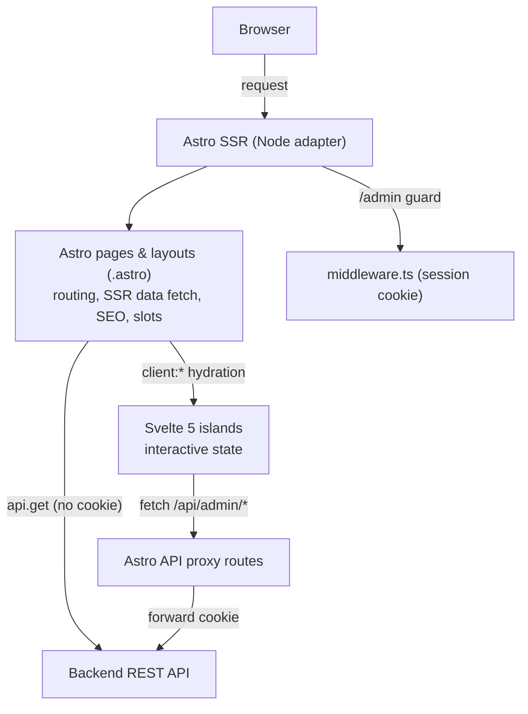
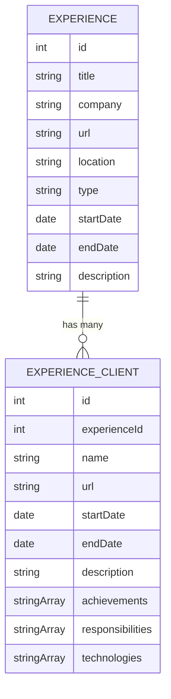
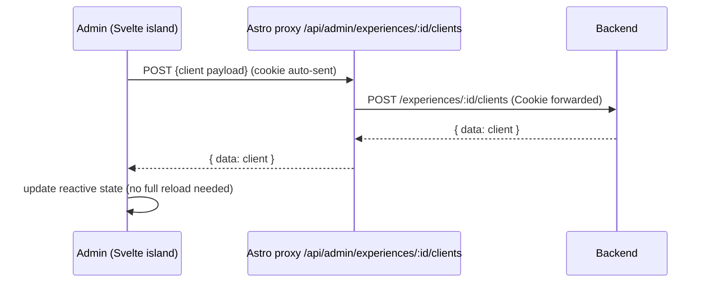

# Frontend v2 — Status & Architecture (Migration + Experience Details)

> **What this document is now.** This was originally a forward-looking plan for
> (a) the **Astro 5/6 + Svelte 5 + Tailwind v4** migration and (b) a net-new
> **Experience Details** feature (experiences with nested clients) across the
> public site, the admin panel, and the backend API. **Most of it is now built.**
> This revision converts it into a **STATUS + plan**: what is DONE (with concrete
> file paths), what is PENDING, and the still-valuable context (decision
> rationale, data model, API contract, conventions, open questions) reframed
> accordingly.
>
> **Where things live now:**
>
> - **Visual / UI design** is no longer "out of scope / deferred" — the **V2
>   redesign is DONE**. The single source of truth for the visual layer (tokens,
>   typography, components, theming, motion, a11y, admin design system) is
>   **`UI-DESIGN.md`**. This document does **not** redescribe visuals; it covers
>   architecture, data flow, and feature status.
> - **App architecture / data flow** context also lives in `FRONTEND-DESIGN.md`.
> - **This document** owns: migration status, the Experience Details feature
>   contract, and the remaining backend + wiring work.

---

## 0. Status at a glance

### Frontend

| Area                                      | Status | Evidence                                                                                                       |
| ----------------------------------------- | :----: | -------------------------------------------------------------------------------------------------------------- |
| Astro **6** SSR + Node standalone adapter |   ✅   | `astro.config.mjs` (`output: "server"`, `@astrojs/node` standalone), `package.json` `astro@^6.4.7`             |
| Svelte 5 islands via `@astrojs/svelte`    |   ✅   | `astro.config.mjs` (`integrations: [svelte()]`), `package.json` `svelte@^5.56.3`, `@astrojs/svelte@^8.1.2`     |
| Tailwind v4 (CSS-first, no config file)   |   ✅   | `@tailwindcss/vite` in `astro.config.mjs`; `src/styles/global.css` (`@import "tailwindcss"` + `@theme inline`) |
| Vanilla scripts → Svelte islands          |   ✅   | see island list in §3                                                                                          |
| Experience Details — public route         |   ✅   | `src/pages/experience/[id].astro` (Zod `safeParse` wired here)                                                 |
| Experience Details — admin editor         |   ✅   | `src/pages/admin/experiences/[id].astro` + `src/components/admin/ExperienceClientsEditor.svelte`               |
| Experience Details — admin proxy routes   |   ✅   | `src/pages/api/admin/experiences/[id]/clients/index.ts` + `[clientId].ts`                                      |
| Experience Details — types & paths        |   ✅   | `src/types/types.ts` (`experienceClientSchema`, `experienceDetailSchema`), `src/utils/constants.ts`            |
| V2 visual redesign                        |   ✅   | see `UI-DESIGN.md` (source of truth)                                                                           |
| Zod `safeParse` at **all** SSR boundaries |   ⬜   | only `experience/[id].astro` validates; admin detail + proxies + other models do not (see §7)                  |
| `WorkType` casing mismatch resolved       |   ⬜   | TS `"On-site"` vs Go `"On Site"` still diverge (see §7)                                                        |

### Backend (Go) — **the Experience-Clients API does NOT exist yet**

| Area                                                          | Status | Evidence                                                                                         |
| ------------------------------------------------------------- | :----: | ------------------------------------------------------------------------------------------------ |
| Experience CRUD (`/experiences`, `/experiences/:id`)          |   ✅   | `backend/internal/routes/routes.go`, `experience_handler.go`, model/dto/repo/service all present |
| `GET /experiences/:id` **embeds `clients`**                   |   ⬜   | `dto.ExperienceResponse` has **no** `clients` field; handler returns experience only             |
| `experience_clients` table / migration                        |   ⬜   | no migration references clients (`backend/migrations/` has none)                                 |
| `ExperienceClient` model / dto / repo / service / handler     |   ⬜   | none exist anywhere under `backend/internal/`                                                    |
| Admin client sub-resource routes (`/experiences/:id/clients`) |   ⬜   | not registered in `routes.go`                                                                    |

> **Bottom line:** the entire frontend for Experience Details is built and waiting.
> The **backend half is the critical path** — until it lands, the public detail
> page renders "No client details added yet." and every admin client action 404s.
> See §5 for the exact contract a backend agent must implement.

---

## 1. Decision (DONE — this is what shipped)

We adopted **Option A**: **Astro** as the SSR/routing layer (Node standalone
adapter), **Svelte 5** (runes) as the interactivity layer via Astro **islands**,
and **Tailwind v4** as the styling system.

### Why (rationale preserved)

- The public portfolio is **content-first** with isolated interactivity (theme
  toggle, modals, micro-interactions). Astro islands ship near-zero JS by default
  and hydrate only what each island needs — best fit for the perf goal.
- The old pain was **fragile vanilla `<script>` + `window` globals** (theme,
  modal, nav, admin forms). Svelte 5 runes (`$state`, `$derived`, `$effect`)
  replaced these with encapsulated, reactive components.
- We migrated **incrementally**, component by component, not as a risky rewrite.
- **SvelteKit** (full SPA) was rejected (loses zero-JS-by-default, forces a
  rewrite). **Vanilla Astro + Tailwind only** was rejected (doesn't fix the DX
  problem). Both still hold.

### Hard constraint (still in force) — SSR + Node adapter

The app **stays SSR** with the **Node standalone adapter** because:

1. Public sections read live data from the backend per request (`experiences`,
   `projects`, `upload-certificates`).
2. `/admin` auth is validated server-side on every request in
   `src/middleware.ts` via the session cookie.

No static export. Per-page `export const prerender = false;` remains the norm
(used by `experience/[id].astro`, admin pages, and feature sections).

---

## 2. Stack (DONE — actual installed versions)

From `frontend/package.json`:

- **Astro** `^6.4.7` — `output: "server"`, adapter `@astrojs/node@^10.1.4`
  (standalone). _(Note: the original plan targeted Astro 5; the repo is on
  **Astro 6**.)_
- **Svelte** `^5.56.3` via `@astrojs/svelte@^8.1.2`.
- **Tailwind CSS** `^4.3.1` via `@tailwindcss/vite@^4.3.1`. **No
  `tailwind.config.js`** — config is CSS-first in `src/styles/global.css`
  (`@import "tailwindcss"` + `@theme inline` bridging the design tokens).
- **Zod** `^4.2.1` — used for types; now also at runtime in the public detail
  boundary (partial; see §7).
- Tooling: ESLint flat config + Prettier with Svelte and Tailwind plugins
  (`eslint-plugin-svelte`, `prettier-plugin-svelte`, `prettier-plugin-tailwindcss`).

`astro.config.mjs` carries the Svelte integration, the Tailwind Vite plugin,
`output: "server"`, the `env` schema (`PORTFOLIO_BACKEND_URL`, `PORT`,
`ENVIRONMENT`), `vite.assetsInclude: ["**/*.docx"]`, and the Node standalone
adapter.

---

## 3. Architecture: Astro vs. Svelte (DONE)



**Stays Astro (server-rendered):** pages/routing under `src/pages/**`, layouts
(`Layout.astro`, `AdminLayout.astro`), SSR data fetch (`api.get(...)` wrapped in
`asyncThrowable`), SEO `<head>`, static content sections (`Hero`, `About`,
`Education`, `Skills`), `Section`, `Footer`, `ApiError`, `src/middleware.ts`, and
all `/api/**` proxy endpoints.

**Now Svelte 5 islands (DONE).** Confirmed present under `src/components/`:

| Concern                  | Island (file)                                   | Notes                                                                 |
| ------------------------ | ----------------------------------------------- | --------------------------------------------------------------------- |
| Theme toggle             | `ThemeToggle.svelte`                            | dispatches `theme:toggle`; FOUC script stays in `ThemeProvider.astro` |
| Project modal            | `ProjectModal.svelte`                           | shared modal listening for `project:open`                             |
| Navigation               | `NavigationBar.svelte` (via `Navigation.astro`) | scroll state, hamburger, smooth scroll                                |
| Scroll progress          | `ScrollProgress.svelte`                         | top progress bar                                                      |
| Certifications lightbox  | `Lightbox.svelte`                               | **replaces GLightbox** (dependency removed)                           |
| Brand wordmark           | `Logo.svelte`                                   | gradient "jpc" (mirrored by `src/icons/Logo.astro`)                   |
| Admin — experiences list | `admin/ExperiencesManager.svelte`               | replaces `window.openModal` scripts                                   |
| Admin — projects list    | `admin/ProjectsManager.svelte`                  | "                                                                     |
| Admin — clients editor   | `admin/ExperienceClientsEditor.svelte`          | new for Experience Details                                            |

**Reused as-is:** `src/api/api-client.ts`, `src/middleware.ts`, the `/api/admin/*`
proxy routes, `src/utils/utils.ts` (`asyncThrowable`), and the Zod types in
`src/types/types.ts`.

### Removed during v2 (do not resurrect)

- **`ThreeBackground` (Three.js)** — removed entirely. The original plan's task to
  "migrate `ThreeBackground.svelte` with proper RAF/WebGL teardown" is **moot**.
  `three` / `@types/three` are gone from `package.json`. (Per `UI-DESIGN.md`, the
  animated **aurora field** is the replacement signature background.)
- **GLightbox** — replaced by `Lightbox.svelte`; `glightbox` removed from deps.

---

## 4. Migration phases (all DONE)

- **Phase 0 — Foundation.** ✅ `@astrojs/svelte` + Tailwind v4 wired in
  `astro.config.mjs`; standalone server boots.
- **Phase 1 — Prove the island pattern.** ✅ `ThemeToggle` + `ProjectModal`
  migrated first (the worst `window`-global offenders).
- **Phase 2 — Tailwind baseline.** ✅ Tokens live as CSS custom properties in
  `Layout.astro` and are bridged into Tailwind v4 via `@theme inline` in
  `global.css`.
- **Phase 3 — Experience Details.** ✅ Frontend complete (§5–6). **Backend
  pending.**
- **Phase 4 — Finish the migration.** ✅ Remaining vanilla scripts converted;
  admin CRUD modernized to Svelte managers.

> The one thing Phase 2's "no visual redesign here" note deferred — the actual V2
> look — has since been completed and documented in `UI-DESIGN.md`.

---

## 5. Experience Details — data model & API contract

### 5.1 Concept (DONE on the frontend)

Clicking an experience opens a **dedicated page** at `/experience/[id]` (better
for SEO/deep-linking than a modal). An experience is an **employer/engagement**;
beneath it are **multiple clients**, each with its own period, achievements,
responsibilities, and technologies.



### 5.2 Frontend types (DONE — `src/types/types.ts`)

`experienceClientSchema`, `experienceDetailSchema`, and the `ExperienceClient` /
`ExperienceClients` / `ExperienceDetail` types are implemented. Dates use
`z.coerce.date()` so the schema can `safeParse` a raw JSON response:

```ts
export const experienceClientSchema = z.object({
  id: z.number().positive(),
  experienceId: z.number().positive(),
  name: z.string(),
  url: z.url().optional(),
  startDate: z.coerce.date(),
  endDate: z.coerce.date().optional(),
  description: z.string().optional(),
  achievements: z.array(z.string()).default([]),
  responsibilities: z.array(z.string()).default([]),
  technologies: z.array(z.string()).default([]),
  createdAt: z.coerce.date(),
  updatedAt: z.coerce.date(),
});

export const experienceDetailSchema = experienceSchema.extend({
  startDate: z.coerce.date(),
  endDate: z.coerce.date().optional(),
  clients: z.array(experienceClientSchema).default([]),
});
```

> `achievements` / `responsibilities` / `technologies` are **string arrays**
> (richer, order-preserving), intentionally diverging from `Project.technologies`
> (a single comma-separated string). The schema is the **frontend's expected
> response shape** — the backend must emit it.

### 5.3 API contract — **THIS IS THE PENDING BACKEND WORK** ⬜

The backend keeps its `{ data, ... }` envelope and the existing `ApiClient`
unwrap behavior. None of the following exists yet (verified: no client routes in
`backend/internal/routes/routes.go`, no `clients` field on
`dto.ExperienceResponse`, no `experience_clients` migration/model/repo/service).

**Public read (no cookie) — clients embedded in the detail:**

- `GET /experiences/:id` → must return existing experience fields **plus**
  `clients: ExperienceClient[]`. One request renders the whole detail page.
  Currently it returns the experience **without** clients
  (`backend/internal/handlers/experience_handler.go` →
  `dto.ToExperienceResponse`).

**Admin CRUD (cookie-forwarded) — clients as a sub-resource:**

- `GET    /experiences/:id/clients`
- `POST   /experiences/:id/clients`
- `GET    /experiences/:id/clients/:clientId`
- `PATCH  /experiences/:id/clients/:clientId`
- `DELETE /experiences/:id/clients/:clientId`

Mutating routes must sit behind `middleware.AuthMiddleware(authService)` and
`middleware.ValidateRequest[...]()`, exactly like the existing experience routes
in `routes.go`.

**Field casing (decided — mirror the existing `Experience` convention):**

- **Responses: camelCase.** `dto.ExperienceResponse` already emits
  `startDate` / `endDate` / `createdAt` / `updatedAt`. Client responses must use
  `id`, `experienceId`, `name`, `url`, `startDate`, `endDate`, `description`,
  `achievements`, `responsibilities`, `technologies`, `createdAt`, `updatedAt`
  (matches `experienceClientSchema`).
- **Write payloads: snake_case dates.** The existing `dto.ExperienceRequest`
  uses `start_date` / `end_date`, and the frontend editor already sends
  `start_date` / `end_date` (see `ExperienceClientsEditor.svelte` → `payload`).
  So the client request DTO should accept `name`, `url`, `start_date`,
  `end_date`, `description`, `achievements[]`, `responsibilities[]`,
  `technologies[]`.

**Array storage (backend's choice; recommendation below):** the frontend only
needs the three arrays as JSON string arrays in responses. Given the GORM +
SQLite/Turso stack (`backend/pkg/database/database.go`) and that
`projects.technologies` is a single `TEXT` column, the cleanest fit is to store
each array as a **JSON-encoded `TEXT` column** on `experience_clients` (custom
GORM type or `[]byte` + (un)marshal). Related child tables are also acceptable.

`src/utils/constants.ts` already exposes the nested path helper:

```ts
export const API_PATHS = {
  EXPERIENCES: "experiences",
  EXPERIENCE_CLIENTS: (experienceId: number | string) =>
    `experiences/${experienceId}/clients`,
  // ...
};
```

### 5.4 Suggested backend implementation checklist (for a backend agent)

Mirror the existing experience vertical slice. Files to add/modify under
`backend/`:

1. **Migration** `migrations/<ts>_create_experience_clients_table.sql` (goose
   format: `-- +goose Up/Down`, `StatementBegin/End`; dialect sqlite3). Table
   `experience_clients` with `id`, `experience_id` (FK → `experiences.id`),
   `name`, `url`, `start_date`, `end_date`, `description`, `achievements`,
   `responsibilities`, `technologies` (JSON `TEXT`), `created_at`, `updated_at`,
   `deleted_at` (soft delete, matching `gorm.Model`). Add the same
   `update_*_updated_at` trigger pattern used by the experiences migration.
2. **Model** `internal/models/experience_client.go` — `gorm.Model` + fields;
   `ExperienceID uint`; arrays as a JSON-serialized column type.
3. **DTOs** `internal/handlers/dto/experience_client_dto.go` —
   `ExperienceClientResponse` (camelCase, incl. `experienceId`), `…Request` /
   `Update…Request` (snake_case dates), plus a `ExperienceDetailResponse` that
   embeds `Clients []ExperienceClientResponse` (or add `Clients` to
   `ExperienceResponse`).
4. **Repository** `internal/repository/experience_client_repository.go` —
   `FindByExperienceID`, `FindByID`, `Create`, `Update`, `Delete`; and a way for
   the experience read path to **preload** clients.
5. **Service** `internal/services/experience_client_service.go`.
6. **Handler** `internal/handlers/experience_client_handler.go`; modify
   `GetExperienceByID` (or service) to include clients in the detail response.
7. **Routes** — register the five sub-resource routes in `routes.go` (public GET
   list/detail open; POST/PATCH/DELETE behind auth + validate).
8. **Wiring** — add repo/service/handler to `registerDependencies` and the
   `routes.SetupRoutes` signature in `cmd/api/main.go`.

---

## 6. Experience Details — frontend (DONE)

### 6.1 Public site ✅

- **Route `src/pages/experience/[id].astro`** (`prerender = false`): SSR-fetches
  `api.get(`${API_PATHS.EXPERIENCES}/${id}`)` via `asyncThrowable`, then
  **validates with `experienceDetailSchema.safeParse`** (Zod is wired here),
  renders the `<ApiError>` empty/error pattern, then the detail header + client
  cards (responsibilities / achievements / technologies). Clients are **sorted by
  `startDate` ascending**. Wrapped in `Layout` with `<Navigation>` + `<Footer>`.
- **Entry point** `src/features/Experience.astro`: the timeline card now has a
  stretched **"View details →"** link to `/experience/${experience.id}`, while the
  company name remains a separate external `url` link — both capabilities kept.

### 6.2 Admin panel ✅

- **Route `src/pages/admin/experiences/[id].astro`** (`prerender = false`,
  `AdminLayout`, reads `Astro.locals.user`): SSR-loads the experience and mounts
  the editor. ⚠️ It uses `api.get<ExperienceDetail>(...)` **without** Zod
  validation (unlike the public route — see §7).
- **`src/components/admin/ExperienceClientsEditor.svelte`** (`client:load`):
  list + add/edit/delete client forms with reactive state; arrays
  (achievements / responsibilities / technologies) are edited as dynamic
  add/remove input lists. Write payload sends snake_case dates
  (`start_date` / `end_date`); reads normalize camelCase responses.
- **Proxy routes** (mirror `src/pages/api/admin/experiences/[id].ts`):
  - `src/pages/api/admin/experiences/[id]/clients/index.ts` → `GET`, `POST`
  - `src/pages/api/admin/experiences/[id]/clients/[clientId].ts` → `GET`,
    `PATCH`, `DELETE`
  - Each forwards the inbound `cookie`, wraps success as `{ data }` / failure as
    `{ error }` with `error.statusCode || 500` — identical to existing proxies.

> **Auth caveat (carry-over, unchanged):** the middleware guards `/admin` but
> **not** `/api/admin/*`. The client proxy routes inherit this — their protection
> relies on the backend rejecting requests without a valid session cookie.



---

## 7. Conventions to preserve (+ status of the one improvement)

- **Response envelope** `{ data }`, `ApiClient` unwrap, proxy re-wrap — **kept**.
- **Cookie chain** browser → SSR/proxy → `api.*(cookie)` → backend — **kept**.
- **Error handling** via `asyncThrowable` tuples and `ApiError(statusCode)` —
  **kept**.
- **Zod at the SSR boundary — PARTIALLY done.** `experience/[id].astro` now calls
  `experienceDetailSchema.safeParse` on the raw response. **Still pending:** the
  admin detail page `admin/experiences/[id].astro` and the client proxy routes do
  **not** validate (they cast with `api.get<ExperienceDetail>` / typed proxies),
  and the other public models (experiences list, projects, certifications) still
  skip runtime validation. Backfilling `safeParse` there is the remaining
  hardening task.

### Known quirks (still relevant)

- **`WorkType` mismatch (UNRESOLVED).** TS enum `WorkType.ON_SITE = "On-site"`
  (hyphen) in `src/types/types.ts`, while the Go model
  (`backend/internal/models/experience.go`) and validation use `"On Site"`
  (space). Reuse the experience's existing handling for clients; do **not**
  introduce a third variant.
- **snake_case vs camelCase split (now intentional & documented in §5.3):** admin
  **write** payloads send snake_case dates; **responses** are camelCase. New
  client endpoints must follow the same split.

---

## 8. Open questions / risks (updated)

- **Client payload casing — RESOLVED (frontend side).** Writes send snake_case
  dates (`start_date` / `end_date`); responses expected camelCase. The backend
  must mirror the existing `Experience` convention (§5.3). Still requires backend
  implementation to honor it.
- **Backend storage of arrays — OPEN (backend decision).** Recommended: JSON
  `TEXT` columns on `experience_clients`. The frontend contract only requires
  JSON string arrays in responses.
- **Client ordering — RESOLVED for now.** The public detail page sorts clients by
  `startDate` ascending (`experience/[id].astro`). No explicit `order` field is
  required unless manual ordering becomes a need; if so, add an `order` column to
  the contract.
- **Validation coverage — OPEN.** Only the public detail boundary runs Zod
  `safeParse` today (see §7).

---

## 9. No longer "out of scope"

- The **visual/UI design of v2 is DONE** and owned by **`UI-DESIGN.md`** (the
  former "deferred design pass"). Tailwind v4 is the implementation tool.
- The **only remaining net-new work is the Go backend Experience-Clients API**
  (§5.3–5.4). Once it ships, the already-built frontend (public detail page,
  admin editor, proxies, types) lights up with no further wiring beyond the
  optional `safeParse` hardening in §7.
